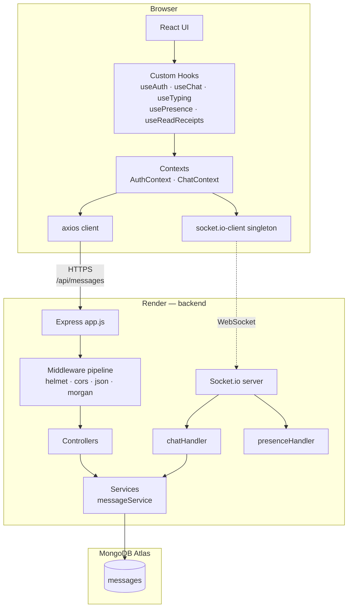
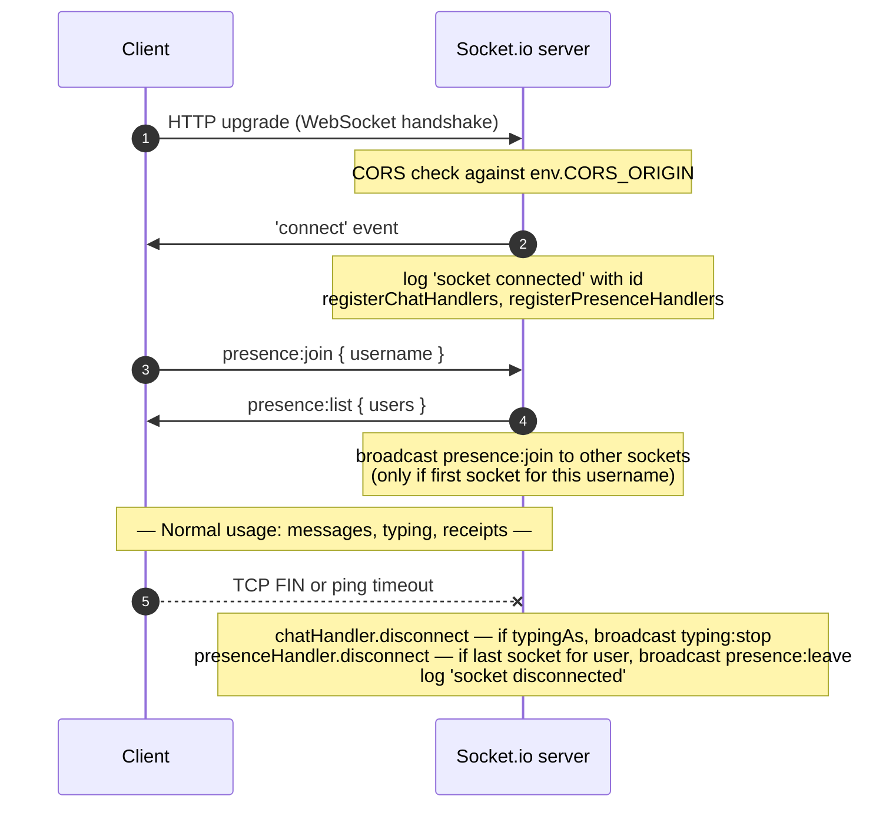
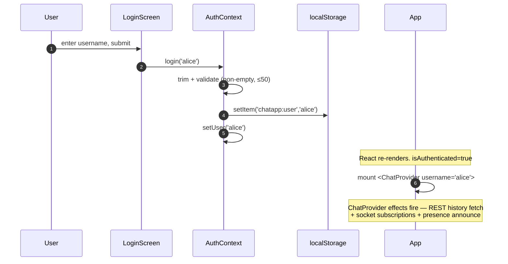
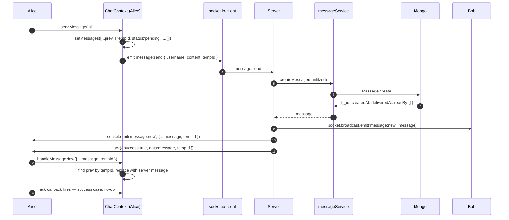
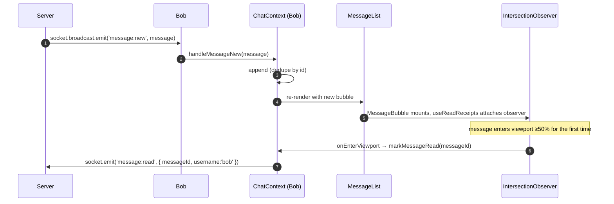
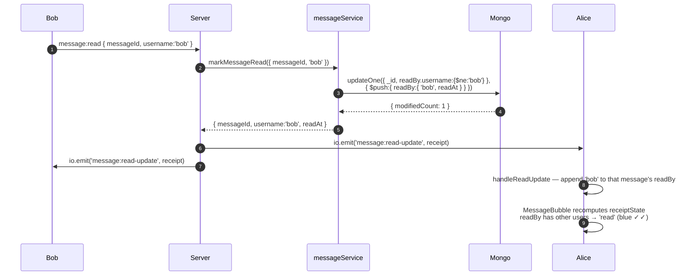
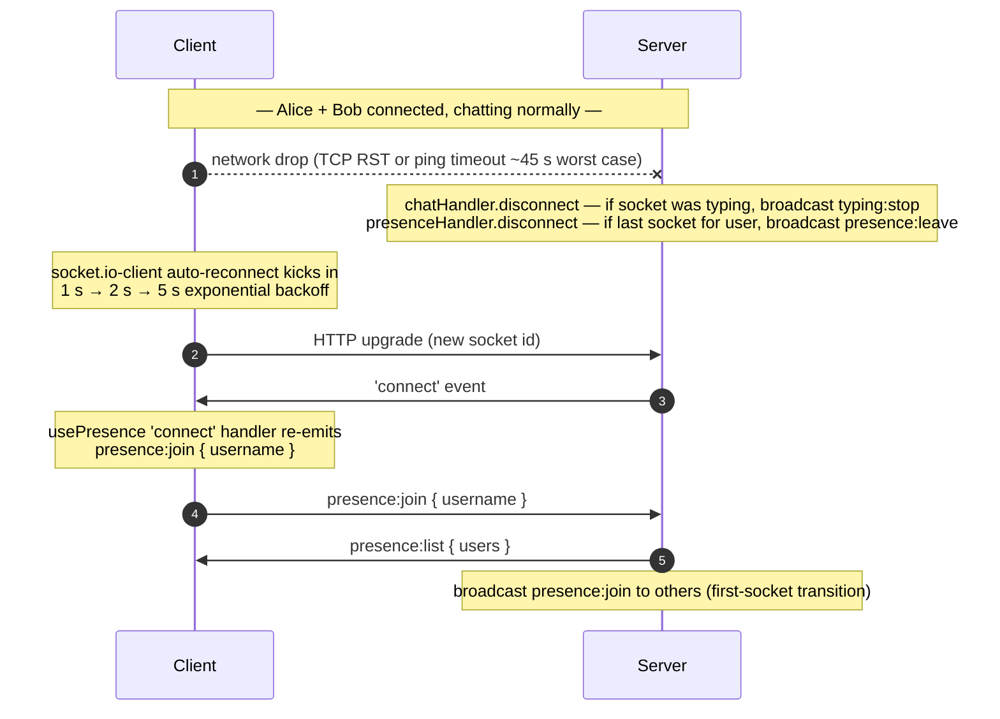

# TECHNICAL DESIGN

The deep engineering companion to [`../README.md`](../README.md) (project overview) and [`APPROACH.md`](./APPROACH.md) (per-feature design rationale with alternatives-rejected).

This doc is **architecture-first, feature-agnostic** — read it to understand HOW the system fits together. When you want the WHY on a specific feature, jump into `APPROACH.md`'s per-feature sections.

---

## 1. High-Level Architecture



**Two transports connect frontend to backend:**
- **REST (axios)** — used once, on mount, to fetch the initial 50 messages
- **WebSocket (Socket.io)** — persistent connection for every live event (message send/broadcast, typing, presence, receipts)

**Backend is layered:** HTTP middleware → controllers → services → models → Atlas. Socket handlers bypass HTTP but **reuse the same services** — one business-logic implementation shared across both transports (no drift possible).

---

## 2. Frontend Architecture

### Component tree

```
<App>                                       auth gate
├── <LoginScreen>                           unauthed branch
└── <ChatProvider>                          authed — owns messages + socket subscriptions
    └── <AuthenticatedApp>
        ├── header (brand + user badge + logout)
        ├── <ConnectionBanner>              visible when !isConnected
        └── main.shell-body
            └── .chat-layout                flex row
                ├── <ChatWindow>            flex-1
                │   ├── <MessageList>
                │   │   └── <MessageBubble> ×N   each with useReadReceipts observer
                │   ├── <TypingIndicator>
                │   └── <MessageInput>
                └── <OnlineUsers>           240px right sidebar
```

### State layers

| Context | Owns | Consumed by |
|---|---|---|
| `AuthContext` | `user`, `login()`, `logout()`, `isAuthenticated` | `App`, `LoginScreen`, `AuthenticatedApp` |
| `ChatContext` | `messages`, `sendMessage()`, `markMessageRead()`, `isConnected`, `isLoadingHistory`, `historyError` | `AuthenticatedApp` → prop-drilled into `ChatWindow` / `MessageList` / `MessageBubble` |

Two hooks are self-contained (no Context — they own state locally):
- `useTyping({ username })` — throttled emit + listener with per-user staleness cleanup
- `usePresence({ username })` — announce on connect + listener maintaining roster

### Hook composition inside AuthenticatedApp

```
const { messages, sendMessage, markMessageRead,
        isConnected, isLoadingHistory, historyError } = useChat();
const { typers, handleTyping, handleStopTyping }     = useTyping({ username });
const { onlineUsers }                                = usePresence({ username });
```

### Presentational-vs-container split

`App` and `AuthenticatedApp` are containers — they call hooks, hold state. `ChatWindow`, `MessageList`, `MessageBubble`, `MessageInput`, `OnlineUsers`, `TypingIndicator`, `ConnectionBanner` are presentational — they take props, render UI, don't call any hooks that touch data. Makes each component trivially testable with mock props.

---

## 3. Backend Architecture

### Layer diagram

```
┌───────────────────────────────────────────────┐
│ server.js — HTTP lifecycle,                   │
│             graceful shutdown, DB connect     │
└──────────────┬────────────────────────────────┘
               │ createServer, initSockets
      ┌────────┴────────┐
      ▼                 ▼
┌──────────┐   ┌────────────────────┐
│  app.js  │   │  sockets/index.js  │
│ Express  │   │   Socket.io server │
└────┬─────┘   └────────┬───────────┘
     │                  │
     ▼                  ▼
┌─────────────┐   ┌────────────────┐
│ middleware/ │   │ chatHandler    │
│ (helmet,    │   │ presenceHandler│
│  cors,      │   └───────┬────────┘
│  json,      │           │
│  morgan)    │           │
└────┬────────┘           │
     ▼                    │
┌─────────────┐           │
│  routes/    │           │
└────┬────────┘           │
     ▼                    ▼
┌─────────────────────────────────┐
│ controllers/  — thin, async     │
└─────────┬───────────────────────┘
          ▼
┌─────────────────────────────────┐
│ services/  — business logic     │
│  messageService                 │
└─────────┬───────────────────────┘
          ▼
┌─────────────────────────────────┐
│ models/  — Mongoose             │
│  Message                        │
└─────────┬───────────────────────┘
          ▼
      MongoDB Atlas
```

### REST request lifecycle — `POST /api/messages`

1. Client sends `POST /api/messages { username, content }`
2. `helmet` sets security headers
3. `cors` verifies `Origin` against `env.CORS_ORIGIN`
4. `express.json({ limit: '100kb' })` parses body
5. `morgan` logs the request
6. Router matches → route-level `validateBody(MESSAGE_BODY_SCHEMA)` runs
7. On validation failure → `next(err)` → central `errorHandler` → 400 JSON with `details[]`
8. On success → `messageController.create` (wrapped in `asyncHandler`)
9. Controller calls `messageService.createMessage(sanitized)` — no HTTP concerns inside
10. Service `Message.create({ username, content })` → Mongoose validates + persists → Atlas
11. Controller returns 201 with `{ success: true, data: message.toJSON() }`
12. Any thrown error bubbles to `errorHandler` — one place, consistent envelope

### Config + boot

`config/env.js` reads `process.env` once, validates required vars, exports a frozen object. Missing required vars → `process.exit(1)` at boot with a clear message. Fail-fast > silent `undefined`.

`config/db.js` connects Mongoose. On initial-connection failure it logs and returns — the server still boots. `/health` reports `db: "disconnected"` in that state. Reconnect / error events are logged.

`server.js` — orchestrates: `connectDB() → createApp() → createServer(app) → initSockets(httpServer) → listen()`. Registers SIGINT / SIGTERM shutdown that closes sockets first, then HTTP server, then Mongo, then `process.exit(0)`. A 10-second `.unref()`ed timer force-exits if any step hangs.

---

## 4. Socket.io Architecture

### Connection lifecycle



### Broadcast strategy — three primitives

| Primitive | Reach | Used for |
|---|---|---|
| `socket.emit(event, data)` | Sender only | `message:new` echo with tempId, `presence:list`, `message:error` |
| `socket.broadcast.emit(event, data)` | Everyone EXCEPT sender | `message:new` to others, `typing:start`/`stop`, `presence:join`/`leave` |
| `io.emit(event, data)` | Everyone (including sender) | `message:read-update` (keeps every client's `readBy` in sync) |

Choice per event is deliberate — see APPROACH.md for the per-decision rationale.

### Handler organisation

`sockets/index.js` handles the connection lifecycle (log, dispatch, log disconnect). Per-domain handlers register on each socket:
- `chatHandler` — `message:send`, `message:read`, `typing:start`, `typing:stop`
- `presenceHandler` — `presence:join`

Both handlers add their own `'disconnect'` listener (Node EventEmitter supports multiple). This keeps chat concerns in one file and presence concerns in another — no cross-cutting `if (typingAs) ...` in a monster handler.

---

## 5. System Flows

### 5.1 Login



### 5.2 Message send — optimistic + reconciliation



Race defused by ordering: server emits `message:new` to sender BEFORE calling the ack. Reconciliation happens on `message:new`. Ack becomes a fallback for `success: false` (rollback).

### 5.3 Message receive + auto-read



`firedRef` inside `useReadReceipts` guarantees single-fire per mount even under React StrictMode's double-mount.

### 5.4 Read-receipt flow (Alice sees the blue tick)



**Duplicate safety:** the `$ne` filter causes `modifiedCount === 0` if bob already read the message — service returns `null`, no broadcast fires. Same effect if the client's `useReadReceipts` fires twice (StrictMode).

### 5.5 Connection lifecycle (disconnect + reconnect)



### 5.6 Data persistence flow

**Reads (initial history):**
```
ChatProvider useEffect fires
  ↓
GET /api/messages?limit=50
  ↓
Server → messageService.listMessages({ limit: 50 })
  ↓
Mongo query — Message.find({}).sort({ createdAt: -1 }).limit(51)
  ↓
Server slices to 50, reverses to chronological, returns { messages, hasMore, nextCursor }
  ↓
ChatProvider merges into state — dedupe by id with any live messages already received
```

**Writes (send):**
```
Client → socket.emit('message:send', { username, content, tempId })
  ↓
Server → validate → messageService.createMessage
  ↓
Message.create → Mongo INSERT (server-generated createdAt, deliveredAt, empty readBy)
  ↓
Server broadcasts message:new + acks
```

**Read-state updates:**
```
Client → socket.emit('message:read', { messageId, username })
  ↓
Server → messageService.markMessageRead
  ↓
Message.updateOne with $push + $ne dedupe
  ↓
Server broadcasts message:read-update
  ↓
All clients update local message.readBy
```

---

## 6. Database Design

### Collection

Single collection: `messages`.

### Schema (Mongoose)

```
Message
├── _id            ObjectId            PK, auto-generated
├── username       String              required, trim, min 1, max 50
├── content        String              required, trim, min 1, max 1000
├── deliveredAt    Date                default: Date.now
├── readBy         [ReadReceipt]       default: []
│   └── ReadReceipt (embedded)
│       ├── username  String           required, trim
│       └── readAt    Date             required, default: Date.now
├── createdAt      Date                auto (Mongoose timestamps: true)
└── updatedAt      Date                auto (Mongoose timestamps: true)
```

**`toJSON` transform** — `_id → id`, drop `__v`. REST responses stay clean and Mongoose-implementation-agnostic.

### Indexes

| Index | Purpose |
|---|---|
| `{ createdAt: -1 }` | Cursor pagination for `GET /api/messages?before=<cursor>` — O(log N) at any depth |
| `{ _id: 1 }` | Default primary key — supports `Message.findById` and `updateOne({_id})` for `markMessageRead` |

**Not indexed** (with rationale):
- `username`, `content` — no query patterns filter on them today; a "search by user" feature would add `{ username: 1, createdAt: -1 }`
- `readBy.username` — only queried inside a single-document `$ne` filter within `updateOne`; would matter only for a `find({'readBy.username': X})` pattern which we don't have

### Design justifications

- **`readBy` embedded, not separate collection.** Receipts are small, only ever queried in the context of their parent, and don't need their own lifecycle. Embedded = single query, no join.
- **`deliveredAt` defaults to `Date.now()` at create.** In this architecture persistence + broadcast are effectively atomic — `deliveredAt ≈ createdAt`. A queue-based fanout system would set `deliveredAt` explicitly after broadcast success.
- **No transactions.** Every write is a single document; atomicity comes for free from Mongo's per-document atomicity guarantee.

---

## 7. Business Logic

### Message rules
1. **Server-generated `createdAt`** — client-supplied timestamps are ignored; prevents clock-skew ordering bugs
2. **Trim on ingest** — whitespace-only submissions rejected at both HTTP and DB layers (defense in depth)
3. **Length caps** — username ≤50, content ≤1000, enforced by both middleware and Mongoose
4. **`readBy` is monotonic** — no receipt is ever removed; a user can't "unread" a message

### Send semantics
- **REST `POST /api/messages`** persists a message. Does NOT broadcast to sockets — REST is a fallback path. Frontend uses sockets for send.
- **Socket `message:send`** persists AND broadcasts to all others, plus echoes to sender with `tempId` for optimistic reconciliation.

### Read semantics — "any-read = blue"
The blue tick appears on sender's UI when **at least one OTHER user** is in `readBy`. Group-chat trade-off vs WhatsApp DM's "all-read = blue". Rationale: without a defined recipient set (the "lobby" is open, users come and go), "all-read" is ambiguous. `computeReceiptState` in the frontend is swap-ready if requirements change.

### Typing semantics
- Client throttles `typing:start` to every 2 s while actively typing (keep-alive for staleness detection)
- Client fires `typing:stop` after 2 s idle OR immediately on blur / after send
- Server relays, no aggregation
- Server broadcasts `typing:stop` on socket disconnect if the socket was mid-type
- Receiver has a 5 s staleness timer as third-layer fallback

### Presence semantics
- One user with N tabs counts as ONE "online" entry
- `presence:join` broadcasts only when user's socket count transitions **0 → 1**
- `presence:leave` broadcasts only when it transitions to **0**
- `presence:list` unicast to joiner only; others have their roster from historical `presence:join` events

### Connection semantics
- Frontend uses a singleton socket. All components share it via `getSocket()`
- On logout: `disconnectSocket()` fires so server sees a clean departure → broadcasts `presence:leave` on user's behalf
- On network loss: Socket.io auto-reconnects with 1 s → 5 s exponential backoff, infinite attempts. UI surfaces state via `ConnectionBanner` + input disable
- `getSocket()` auto-reconnects a previously-disconnected singleton so login/logout cycles reuse the same instance

---

## 8. API Documentation

### `GET /health`

Liveness + DB status probe.

**Response 200:**
```json
{
  "status": "ok",
  "uptime": 123.456,
  "db": "connected",
  "env": "production",
  "timestamp": "2026-07-12T12:00:00.000Z"
}
```

`db` values: `"connected"` | `"connecting"` | `"disconnected"` | `"disconnecting"`.

### `GET /api/messages`

Paginated chat history in chronological order (oldest → newest inside the array).

**Query params:**
| Param | Type | Default | Range |
|---|---|---|---|
| `limit` | integer | 50 | 1–100 (clamped server-side) |
| `before` | ISO 8601 date string | none | any valid ISO date |

**Response 200:**
```json
{
  "success": true,
  "data": {
    "messages": [
      {
        "id": "6a5325...",
        "username": "alice",
        "content": "Hello",
        "createdAt": "2026-07-12T10:00:00.000Z",
        "deliveredAt": "2026-07-12T10:00:00.000Z",
        "readBy": [{ "username": "bob", "readAt": "2026-07-12T10:01:00.000Z" }]
      }
    ],
    "hasMore": true,
    "nextCursor": "2026-07-12T09:55:00.000Z"
  }
}
```

Use `nextCursor` as `?before=` on the next request to fetch the previous batch.

**Response 400 `INVALID_CURSOR`:**
```json
{
  "success": false,
  "error": {
    "code": "INVALID_CURSOR",
    "message": "Invalid \"before\" cursor — must be a valid ISO date"
  }
}
```

### `POST /api/messages`

Create a message (REST fallback; frontend uses socket path for live UX).

**Body:**
```json
{ "username": "alice", "content": "Hello" }
```

**Response 201:**
```json
{ "success": true, "data": { "id": "...", "username": "alice", "content": "Hello", ... } }
```

**Response 400 `VALIDATION_ERROR`:**
```json
{
  "success": false,
  "error": {
    "code": "VALIDATION_ERROR",
    "message": "Validation failed",
    "details": [
      { "field": "username", "message": "username is required" },
      { "field": "content", "message": "content must be at most 1000 character(s)" }
    ]
  }
}
```

### Response envelope

All REST responses conform to:
```
{ "success": true,  "data": ... }
{ "success": false, "error": { "code": "...", "message": "...", "details": [...] } }
```

Consumers branch on `success` — one client-side helper handles either shape.

### Unknown routes
Any unmatched route returns:
```json
{
  "success": false,
  "error": {
    "code": "NOT_FOUND",
    "message": "Route GET /api/does-not-exist not found"
  }
}
```

---

## 9. Socket Event Catalog

| Direction | Event | Payload | Purpose |
|---|---|---|---|
| C→S | `message:send` | `{ username, content, tempId? }` | Send a message. tempId optional (enables optimistic reconciliation). |
| S→sender | `message:new` | `{ ...persisted message, tempId }` | Sender's echo carrying tempId back. |
| S→all except sender | `message:new` | `{ ...persisted message }` | Broadcast to others (no tempId). |
| S→sender (ack cb) | *via callback* | `{ success, data?, error?, tempId? }` | Ack — used only for error rollback in the client. |
| S→sender | `message:error` | `{ code, message, details? }` | Validation / persist failure. |
| C→S | `message:read` | `{ messageId, username }` | Reader announces "I saw this". |
| S→all | `message:read-update` | `{ messageId, username, readAt }` | Broadcast readBy delta (io.emit — reader also receives). |
| C→S | `typing:start` | `{ username }` | Throttled to once per 2 s while actively typing. |
| C→S | `typing:stop` | `{ username }` | After 2 s idle, on blur, or after send. |
| S→all except sender | `typing:start` / `typing:stop` | `{ username }` | Relayed. |
| C→S | `presence:join` | `{ username }` | Announce on connect (fires again on reconnect). |
| S→joiner | `presence:list` | `{ users }` | Full current roster (unicast). |
| S→all except sender | `presence:join` / `presence:leave` | `{ username }` | Broadcast on user's first-socket / last-socket transition. |
| S→C | `connect` / `disconnect` | *Socket.io built-in* | Lifecycle. |

---

## 10. Folder Structure

Full tree in [`../README.md`](../README.md#project-structure). Per-folder rationale:

**Backend `src/`:**
| Folder | Reason to exist | Example changes that touch it |
|---|---|---|
| `config/` | Read env + connect DB in one place | Add a new required env var |
| `middleware/` | Cross-cutting HTTP concerns | Add rate limiting |
| `models/` | Data contract with Mongo | Add a field, change an index |
| `services/` | Business logic — no HTTP, no sockets | Add "search messages" feature |
| `controllers/` | HTTP-shape translation | Change response envelope |
| `routes/` | URL → handler mapping | Add a new endpoint |
| `sockets/` | Real-time event handlers | Add a new socket event |
| `utils/` | Small pure helpers | Add a slug generator |

**Frontend `src/`:**
| Folder | Reason to exist | Example changes that touch it |
|---|---|---|
| `api/` | HTTP layer — axios setup + endpoints | Add a new API call |
| `socket/` | Socket.io singleton | Change reconnect config |
| `context/` | App-wide state providers | Add a new global concern |
| `hooks/` | Reusable stateful logic | Add a new hook |
| `components/` | UI presentational units | Add a new screen or widget |
| `utils/` | Pure helpers (formatTime, receiptIcons) | Add a formatter |
| `styles/` | Vanilla CSS per feature area | Adjust theme colors |

---

## 11. Design Decisions Log

The comprehensive list is in [`APPROACH.md`](./APPROACH.md), organised per-feature. Highlights indexed by concept:

| Decision | Alternative rejected |
|---|---|
| Layered backend (`routes → controllers → services → models`) | Everything in one route file |
| `app.js` split from `server.js` | Single-file server — mixes concerns, blocks testability |
| Cursor pagination (`?before=<cursor>`) | Offset (`?page=N`) — shifts under live writes, O(N) at depth |
| Hand-rolled validation | zod (over-scaled for 2 endpoints × 2 fields) |
| Two-emit for `message:new` (tempId echo to sender) | Content-based reconciliation (fragile to duplicates) |
| Ack callback for errors only | Ack for both — races with the echo |
| Optimistic send + tempId | Non-optimistic (feels laggy) |
| Any-read = blue tick | All-read (ambiguous in an open-lobby group chat) |
| Server as pure RELAY for typing | Server-side typing map (needless state) |
| Server as ROSTER-AUTHORITATIVE for presence | Client-side roster maintenance (fresh joiners can't see who's online) |
| Multi-tab dedup via socket-count transitions | Reject duplicate connects (breaks multi-device UX) |
| Context + custom hooks | Redux / Zustand — over-scaled for 3 slices of state |
| Vanilla CSS, prefixed classes | CSS-in-JS / Tailwind — overhead |
| React web (not React Native) | RN — toolchain risk on 24-hour clock |
| No test framework | Vitest / Playwright — deferred by time budget |

Every rejected alternative comes with a "here's when I'd revisit" note in APPROACH.md.

---

## 12. Scalability

Current: single-process backend, in-memory typing / presence state, one MongoDB Atlas M0 cluster.

### To scale horizontally (multiple backend instances)

**What breaks:**
- Presence Map is per-process — a user connected to instance A isn't visible to users on instance B
- Typing broadcasts don't cross instances
- `message:new` broadcasts don't cross instances

**Fix:** [`@socket.io/redis-adapter`](https://socket.io/docs/v4/redis-adapter/) — Redis pub/sub distributes socket events across all backend instances.
```js
import { createAdapter } from '@socket.io/redis-adapter';
import { createClient } from 'redis';
const pubClient = createClient({ url: env.REDIS_URL });
const subClient = pubClient.duplicate();
await Promise.all([pubClient.connect(), subClient.connect()]);
io.adapter(createAdapter(pubClient, subClient));
```
Presence Map moves to Redis: `SADD chat:online <username>` on connect, `SREM` on leave, `SMEMBERS` for the roster.

### To scale reads (chat history)

**Current:** every `GET /api/messages` hits Mongo. Cursor pagination + `createdAt` index keeps it O(log N) at any depth. Fine to ~10K messages / minute.

**Fixes at higher scale:**
- Redis cache in front of the "newest 50" query — the vast majority of history requests
- Atlas read replica routed via `readPreference: 'secondaryPreferred'` for `GET /api/messages`

### To scale writes

Message writes are single-document, atomic. Bottleneck at very high scale is single-primary write in Atlas.

**Fixes:**
- Sharded cluster keyed by `createdAt` hashed range
- Introduce a `roomId` dimension and shard by that

### To scale receipts

`readBy` grows unbounded on each Message document. Fine at lobby scale (tens of readers per message).

**Fixes at scale:**
- Cap `readBy` at N most-recent readers on the document (only relevant for immediate UX)
- Extract to a separate `read_receipts` collection with `messageId` foreign key + index on `messageId`. Trade-off: one-query reads become two-query.

---

## 13. Security

### What we do
- **Helmet** — default security headers (X-Content-Type-Options, X-Frame-Options, HSTS in prod, etc.)
- **CORS allowlist** — origins whitelisted via `env.CORS_ORIGIN`, checked on both HTTP requests and WebSocket upgrades
- **Input validation** — every REST body and socket payload validated against a schema; length caps prevent oversized payloads
- **Response never leaks stack traces** — error middleware strips `err.stack` in production responses; only logged
- **JSON body limit** — `express.json({ limit: '100kb' })` blocks megabyte-scale payload floods
- **Env vars only** — no secrets committed; `.env` git-ignored; `.env.example` documents shape
- **`toJSON` transform** — Mongoose internals (`_id`, `__v`) never leak into responses
- **XSS-safe rendering** — React escapes text nodes by default; we don't use `dangerouslySetInnerHTML` anywhere

### What we DON'T do (documented gaps)
- **No real authentication.** Dummy username per assessment scope. A real system would use JWT or session cookies. The `useAuth` hook is the abstraction that makes this a swap without changing consumers.
- **No authorization.** All connected sockets can read all messages. Multi-room / DM would introduce ACL checks per event.
- **No rate limiting.** A malicious client can spam messages or typing events. Fixes: `express-rate-limit` on REST, `socket.use(middleware)` with a per-user token bucket for sockets.
- **No CSRF token.** Not needed with the current design (no session cookies, no state-changing GETs). Would be required if cookie-auth is adopted.
- **MongoDB Atlas IP allowlist is `0.0.0.0/0`.** Required by Render's dynamic egress IPs on the free tier. Production would use a paid Render plan with static egress OR VPC peering into Atlas.
- **No socket auth handshake.** Username passed in every payload; server trusts it. A real system would set `socket.data.username` from a verified token at connect time.
- **No message editing / deletion.** Not required; no audit trail needed yet.

---

## 14. Performance

### What's fast (by design)
- **Cursor pagination + `{createdAt:-1}` index** — history queries are O(log N) at any depth
- **`limit + 1` trick** — detects `hasMore` in a single query, no separate `countDocuments()` round trip
- **Atomic read-receipt update** — one `updateOne` per receipt, deduped at the DB level
- **Optimistic send** — sender sees the message immediately; server round-trip happens in the background
- **`useMemo` + `useCallback` on Context values** — prevents cascading re-renders of every consumer when the provider re-renders
- **`messages.length` (not `messages`) as auto-scroll dep** — receipt updates on existing messages don't retrigger the scroll
- **WebSocket-only transport** — no HTTP long-polling fallback; one connection per client
- **`callbackRef` pattern in `useReadReceipts`** — IntersectionObserver isn't torn down and rebuilt on every parent re-render
- **`socket.broadcast.emit` vs `io.emit`** — chosen per event to minimize wasted network frames

### What could be faster (documented)
- **Client-side message dedupe uses `.some(m => m.id === id)`** — O(n) per incoming message. Fine at N=100, would want a `Set<id>` at N=10,000+.
- **Per-bubble IntersectionObserver.** Fine at scale (browsers optimise aggressively); an outer root-container observer would be marginally cheaper for very long chats.
- **`readBy` scan for "am I in this list"** — O(k). Fine for lobby scale; problem only at k=1000+.
- **No message-list virtualisation.** At N=10,000 messages, React re-render cost climbs. `react-window` would fix.

---

## 15. Future Improvements

Consolidated from the per-feature trade-offs tables in `APPROACH.md`, ranked by "production-ready" ROI:

**High ROI:**
1. Real authentication (JWT or session) — swap `useAuth` internals; consumers unchanged
2. Multi-room support — `io.to(roomId).emit` on backend, room switcher on frontend
3. `@socket.io/redis-adapter` — enable horizontal scaling of the backend
4. Rate limiting on both REST and socket events
5. Message pagination UI (infinite scroll upward using existing `?before=<cursor>`)

**Medium ROI:**
6. Sticky-bottom detection for auto-scroll (don't yank the viewport on new message if the user scrolled up)
7. Sender-side offline queue — buffer messages while `!isConnected`, flush on reconnect
8. Idle detection — `presence:idle` after N minutes of no input (Slack-style dot color change)
9. "Last seen" persistence for offline users
10. Better mobile experience — sidebar-as-drawer under 700 px
11. Retry-by-button on history-load failure

**Lower ROI / bigger scope:**
12. Message editing / deletion (`PATCH` / `DELETE` with soft-delete)
13. All-read semantic for the blue tick (needs online-user count comparison)
14. Message attachments — multipart upload + object storage
15. Push notifications for background tabs
16. Automated test suite — Vitest for units, Playwright for E2E
17. TypeScript migration
18. Message-list virtualisation for very long histories

---

*Read this doc for the "how it fits together" view. Read [`APPROACH.md`](./APPROACH.md) when you want per-feature depth: alternatives-rejected, small refactors, and the running story of design decisions.*
